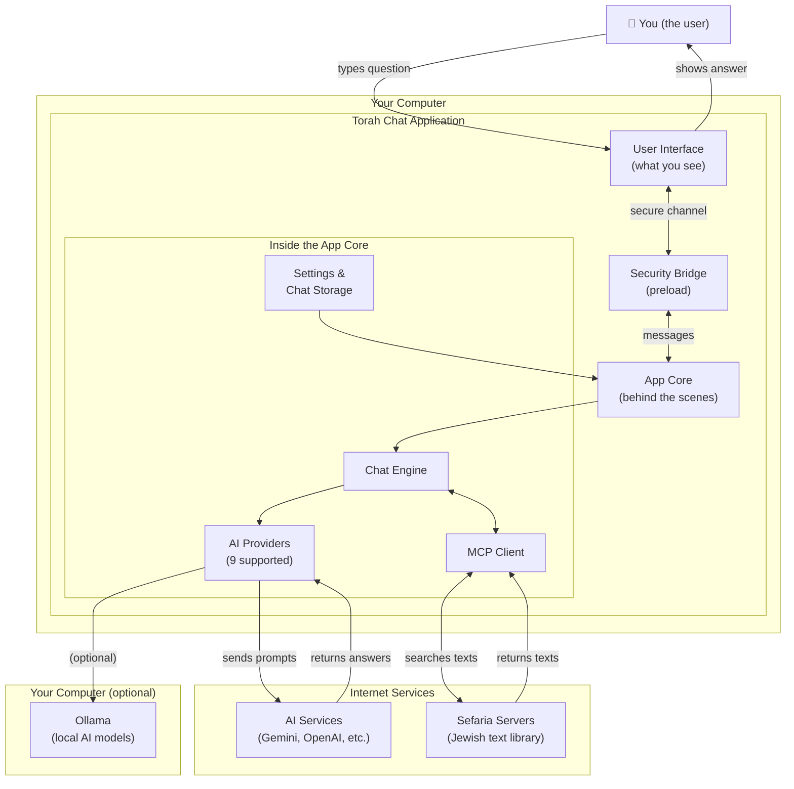
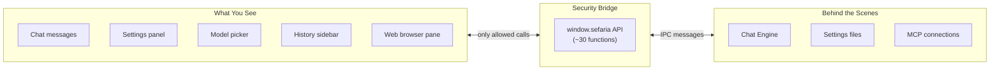
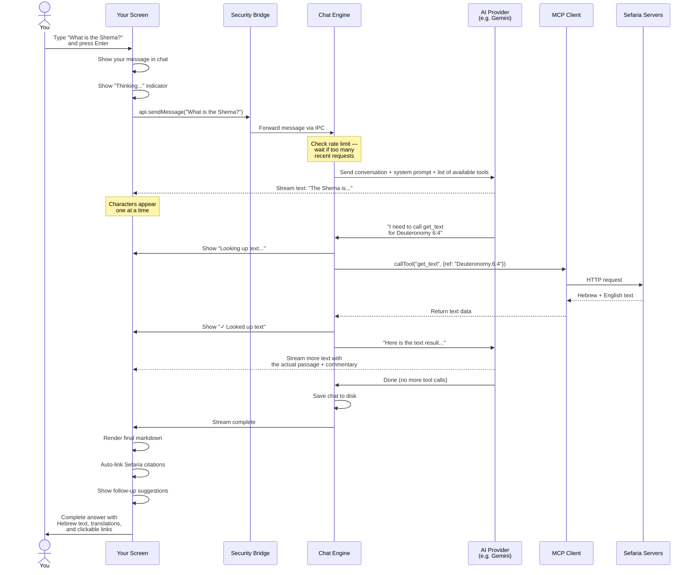
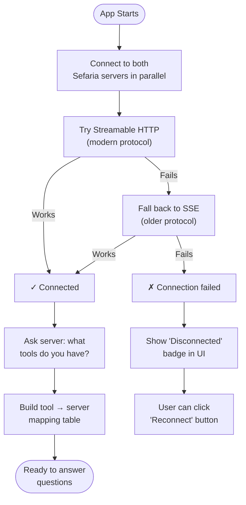
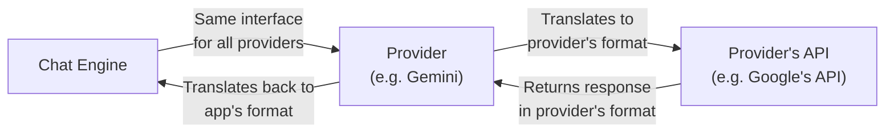
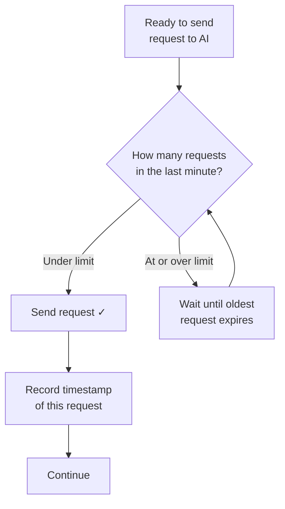
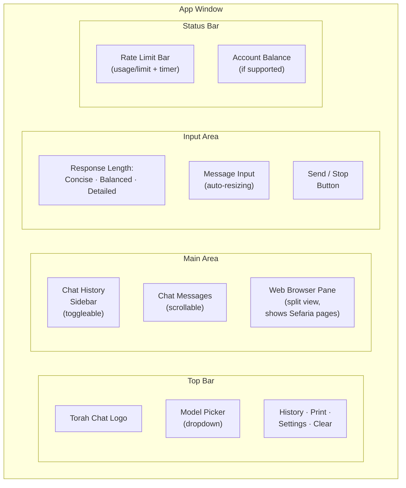
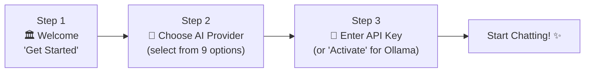
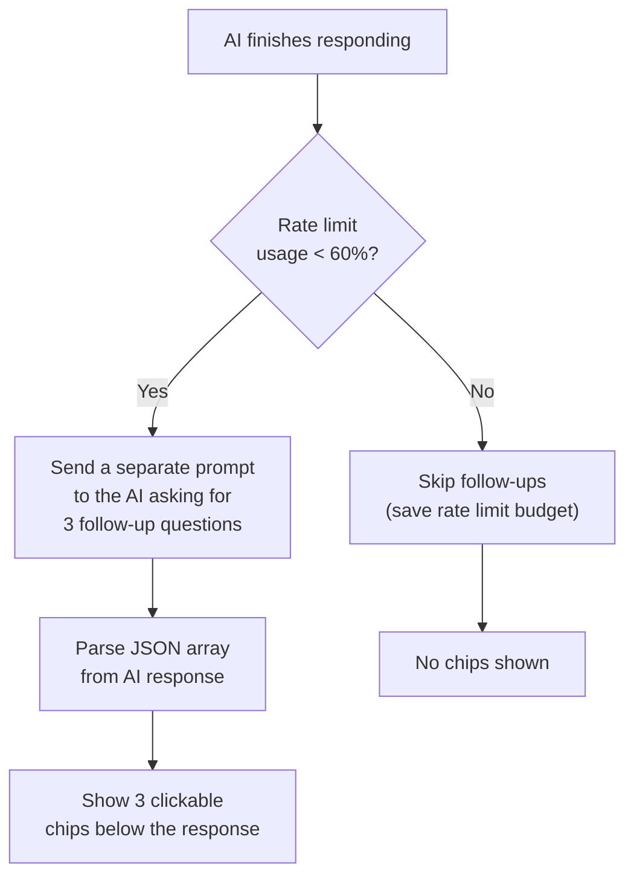
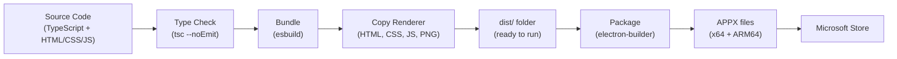

# Torah Chat — Technical Reference Guide

*A plain-language guide to how every part of the application works.*

---

## Table of Contents

1. [What Is This App?](#1-what-is-this-app)
2. [The Big Picture — How Everything Fits Together](#2-the-big-picture)
3. [The Three-Process Architecture](#3-the-three-process-architecture)
4. [How a Message Travels Through the App](#4-how-a-message-travels-through-the-app)
5. [MCP — How the App Talks to Sefaria](#5-mcp--how-the-app-talks-to-sefaria)
6. [The AI Provider System](#6-the-ai-provider-system)
7. [The Chat Engine — The Brain of the App](#7-the-chat-engine)
8. [Rate Limiting — Staying Within the Rules](#8-rate-limiting)
9. [The User Interface (Renderer)](#9-the-user-interface)
10. [Settings and Data Storage](#10-settings-and-data-storage)
11. [Chat History](#11-chat-history)
12. [Security Model](#12-security-model)
13. [First-Time Setup Wizard](#13-first-time-setup-wizard)
14. [Embedded Web Browser Pane](#14-embedded-web-browser-pane)
15. [Printing a Chat](#15-printing-a-chat)
16. [Follow-Up Suggestions](#16-follow-up-suggestions)
17. [Citation Auto-Linking](#17-citation-auto-linking)
18. [Diagrams (Mermaid)](#18-diagrams-mermaid)
19. [NPU Detection and Ollama](#19-npu-detection-and-ollama)
20. [Building and Distributing the App](#20-building-and-distributing-the-app)
21. [Complete File Map](#21-complete-file-map)
22. [Glossary](#22-glossary)

---

## 1. What Is This App?

Torah Chat is a desktop application for Windows that lets you explore the Sefaria digital library of Jewish texts using artificial intelligence. You type a question — like "What does the Torah say about forgiveness?" or "Show me Genesis 1:1 with commentaries" — and the app uses an AI model to search Sefaria's library, retrieve real texts, and compose a detailed, cited answer.

**Key facts:**
- It is a standalone desktop app (not a website) built with Electron
- It is distributed through the Microsoft Store
- It was created by Jason Leznek as an independent project — it is **not** made by Sefaria.org
- It uses Sefaria's publicly available MCP servers to access their library
- It supports 9 different AI providers (Google Gemini, OpenAI, Anthropic/Claude, xAI/Grok, Mistral, DeepSeek, Groq, OpenRouter, and Ollama for local models)
- Current version: 1.2.1

---

## 2. The Big Picture

Here is how the major components of the app relate to each other:



**In plain English:** You type a question. The app sends it to an AI model. The AI model decides it needs to look up real Jewish texts, so it asks the app to call Sefaria's servers. Sefaria returns the actual texts. The AI reads them and composes an answer with real citations. That answer streams back to your screen, character by character.

---

## 3. The Three-Process Architecture

Electron apps (like Torah Chat) run as **three separate processes** that communicate with each other. Think of it like three employees in an office, each with a specific job:

### Process 1: The Main Process (`main.ts`)

**Analogy:** The office manager who handles logistics.

This is the "back office" of the app. You never see it directly. It handles:
- **Window management** — creating and sizing the app window
- **Settings storage** — reading/writing your API keys and preferences to disk
- **Chat history** — saving and loading past conversations as JSON files
- **MCP connections** — connecting to Sefaria's servers and keeping those connections alive
- **Chat engine coordination** — receiving your message, routing it through the AI, and sending results back
- **Security** — validating API keys, sanitizing file paths, enforcing content security policies

### Process 2: The Preload Script (`preload.ts`)

**Analogy:** The receptionist — a secure intermediary.

This is a thin "bridge" that sits between the interface and the back office. Its entire job is to define a safe set of ~30 functions that the interface is allowed to call. It uses Electron's `contextBridge` to expose a `window.sefaria` API. This is a critical security boundary — without it, the interface (which renders web content) could access your entire computer.

**What it exposes (examples):**
| Function | What it does |
|---|---|
| `sendMessage(text)` | Send a chat message |
| `getProviders()` | Get the list of available AI providers |
| `saveProviderConfig(...)` | Save provider/model/API key settings |
| `listChats()` | Get list of saved conversations |
| `cancelMessage()` | Stop a response mid-generation |
| `reconnectMcp()` | Re-establish connection to Sefaria servers |

### Process 3: The Renderer (`renderer/`)

**Analogy:** The customer-facing storefront.

This is everything you see and interact with — the chat window, the settings panel, the sidebar, the text input box. It is written in plain HTML, CSS, and JavaScript (no framework like React). It communicates with the back office **only** through the `window.sefaria` API — it cannot access files, the network, or anything else directly.



---

## 4. How a Message Travels Through the App

When you type a question and press Enter, here is exactly what happens, step by step:



### The Tool-Calling Loop

The most important concept is the **tool-calling loop**. Here's how it works:

1. The app sends your question to the AI along with a list of ~15 "tools" it can use (like `get_text`, `text_search`, `get_topic_details`, etc.)
2. The AI reads your question, thinks about what information it needs, and may request one or more tool calls
3. The app executes those tool calls by contacting Sefaria's servers
4. The results are sent back to the AI
5. The AI can request more tool calls (up to **10 rounds**) or write its final answer
6. This loop continues until the AI has all the information it needs

**Example:** If you ask "Compare the Rashi and Ramban commentaries on Genesis 1:1," the AI might:
- Round 1: Call `get_text` for Genesis 1:1
- Round 2: Call `get_text` for Rashi on Genesis 1:1
- Round 3: Call `get_text` for Ramban on Genesis 1:1
- Round 4: Write the final comparison using all three texts

---

## 5. MCP — How the App Talks to Sefaria

### What is MCP?

MCP stands for **Model Context Protocol**. It is a standard way for AI applications to connect to external data sources. Think of it like a universal plug — any AI app that speaks MCP can connect to any data source that speaks MCP.

### The Two Sefaria Servers

Torah Chat connects to two MCP servers on startup:

| Server | URL | Purpose |
|---|---|---|
| **sefaria-texts** | `mcp.sefaria.org/sse` | Access to the text library — Torah, Talmud, Midrash, commentaries, manuscripts, calendars, etc. |
| **sefaria-developers** | `developers.sefaria.org/mcp` | API documentation — for developers building apps with Sefaria |

### Available Tools

When connected, these servers provide approximately 15 tools the AI can use:

| Tool | What the AI uses it for |
|---|---|
| `get_text` | Look up a specific passage (e.g., Genesis 1:1) |
| `text_search` | Keyword search across the library |
| `english_semantic_search` | Concept-based search (e.g., "forgiveness") |
| `search_in_book` | Search within a specific book or commentary |
| `search_in_dictionaries` | Look up words in Jastrow, Klein, BDB, etc. |
| `get_links_between_texts` | Find cross-references between passages |
| `get_topic_details` | Get Sefaria's curated topic page |
| `get_english_translations` | Compare different English translations |
| `get_text_catalogue_info` | Get metadata about a work (author, date, etc.) |
| `get_text_or_category_shape` | Get the structure/outline of a text |
| `get_current_calendar` | Today's Torah portion, Daf Yomi, Hebrew date |
| `get_available_manuscripts` | Find ancient manuscript images |
| `get_manuscript_image` | Retrieve a manuscript image |
| `clarify_name_argument` | Validate a text reference format |
| `clarify_search_path_filter` | Validate a search filter |

### Connection Process



---

## 6. The AI Provider System

### Overview

Torah Chat supports 9 different AI providers. Each one is an independent module in `src/providers/` that translates between the app's internal format and the specific AI company's API.

### Supported Providers

| Provider | ID | Models | Rate Limit | Requires API Key? | Notable Features |
|---|---|---|---|---|---|
| **Google Gemini** | `gemini` | Gemini 2.5 Flash, 2.5 Flash-Lite, 2.5 Pro, 2.0 Flash | 5-30 RPM (varies by model) | Yes | Free tier available; ESM dynamic import |
| **OpenAI** | `openai` | GPT-4.1 Mini, GPT-4.1, GPT-4o Mini, GPT-4o, o4 Mini | 500 RPM | Yes | Most popular; fast |
| **Anthropic (Claude)** | `anthropic` | Claude Sonnet 4, Claude 3.5 Haiku | 50 RPM | Yes | Strong reasoning |
| **xAI (Grok)** | `grok` | Grok 3 Mini Fast, Grok 3 Mini, Grok 3 Fast, Grok 3 | 60 RPM | Yes | Uses OpenAI-compatible API |
| **Mistral AI** | `mistral` | Mistral Small, Medium, Large | 60 RPM | Yes | European AI provider |
| **DeepSeek** | `deepseek` | DeepSeek-V3, DeepSeek-R1 | 60 RPM | Yes | Balance checking; low cost |
| **Groq** | `groq` | Llama 3.3 70B, Llama 3.1 8B, Gemma 2 9B, Mixtral 8x7B, and more | 30 RPM | Yes | Very fast inference |
| **OpenRouter** | `openrouter` | Multiple models from various providers | 60 RPM | Yes | Aggregates many providers into one API key |
| **Ollama (Local)** | `ollama` | Llama 3.2, Mistral, Phi-3, Gemma 2, Qwen 2.5 (+ auto-detected) | Unlimited | No | Runs entirely on your computer; no internet needed for AI |

### How a Provider Works

Every provider must implement the same interface (like a contract). This means the rest of the app doesn't need to know the differences between Gemini, OpenAI, Claude, etc. — it just talks to "a provider."



Each provider does three things:
1. **`streamChat()`** — Send a conversation to the AI and stream the response back, character by character
2. **`generateOnce()`** — Send a single prompt and get a complete response (used for follow-up suggestions)
3. **`getBalance()`** *(optional)* — Check account credits (only DeepSeek supports this)

### The Canonical Message Format

Internally, Torah Chat uses a "Gemini-style" format for conversation history. Every provider converts to/from this format:

```
Message:
  role: "user" or "model"
  parts: [
    { text: "What is the Shema?" }           — a text message
    { functionCall: { name, args } }           — AI requesting a tool
    { functionResponse: { name, response } }   — result from a tool
  ]
```

This means if you switch from Gemini to OpenAI mid-conversation, the app can continue seamlessly because the history is stored in a universal format.

### Many Providers Use the OpenAI SDK

An interesting implementation detail: 6 of the 9 providers (OpenAI, Grok, Mistral, DeepSeek, Groq, OpenRouter) all use the same OpenAI SDK library. They just point it at different URLs:

| Provider | Base URL |
|---|---|
| OpenAI | `api.openai.com/v1` (default) |
| Grok | `api.x.ai/v1` |
| Mistral | `api.mistral.ai/v1` |
| DeepSeek | `api.deepseek.com` |
| Groq | `api.groq.com/openai/v1` |
| OpenRouter | `openrouter.ai/api/v1` |

This is because many AI companies have adopted OpenAI's API format as a de facto standard.

---

## 7. The Chat Engine — The Brain of the App

The Chat Engine (`chat-engine.ts`) is the central coordinator. It:

1. Receives your message
2. Adds it to the conversation history
3. Builds the system prompt (the hidden instructions that tell the AI how to behave)
4. Gets the list of available tools from the MCP client
5. Enters the tool-calling loop (send to AI → execute tools → repeat, up to 10 rounds)
6. Streams text back to the UI as it arrives
7. Handles cancellation if you click the stop button
8. Generates follow-up question suggestions after each response
9. Tracks rate limit usage

### The System Prompt

The system prompt is a large block of hidden instructions sent with every message. It tells the AI:
- That it is "the Torah Chat assistant, an expert scholar on Jewish texts"
- How to format responses (use Hebrew/Aramaic with translations, cite sources, include commentaries)
- When to use each tool (e.g., "use `get_current_calendar` for anything about today's Torah portion")
- How to create Sefaria hyperlinks (e.g., Genesis 1:1 → `https://www.sefaria.org/Genesis.1.1`)
- Never to expose tool names or internal details to the user
- To use Mermaid syntax for diagrams

It also adjusts based on the **response length** setting:
- **Concise** — "Keep your prose brief — short paragraphs, minimal commentary"
- **Balanced** — "Moderately detailed with key sources and context"
- **Detailed** — "Comprehensive, thorough... extensive commentary, multiple perspectives"

### Response Streaming

When the AI generates text, it doesn't send the entire response at once. Instead, it **streams** it — sending a few characters or words at a time. This is why you can see the text appear progressively on screen, like someone typing in real time.

The streaming chain:
```
AI API → Provider.streamChat() → ChatEngine onTextChunk → IPC 'chat-stream' → Renderer appendChunk()
```

Each chunk is rendered as markdown immediately, so formatting (bold, links, code blocks, etc.) appears as the text arrives.

---

## 8. Rate Limiting

AI providers charge per request and enforce rate limits (maximum requests per minute). Torah Chat has a built-in rate limiter to prevent hitting these limits.

### How It Works



- The engine keeps a list of timestamps for each API call
- Before every request, it counts how many timestamps fall within the rate-limit window (usually 60 seconds)
- If the count is at or above the limit (minus a 1-request safety margin), it waits
- After each request, the new timestamp is recorded
- Old timestamps outside the window are pruned

### Rate Limits by Provider

The rate limit is shown in the status bar at the bottom of the app (e.g., "Gemini 2.5 Flash · 2 / 5 req/min"). Some providers have per-model overrides:

- Gemini 2.5 Flash: 5 RPM
- Gemini 2.5 Flash-Lite: 30 RPM (more generous free tier)
- OpenAI: 500 RPM
- Anthropic: 50 RPM

---

## 9. The User Interface

The interface is built with plain HTML, CSS, and JavaScript — no React, no Vue, no framework. Here are its major components:

### Layout



### Key UI Features

| Feature | Description |
|---|---|
| **Welcome screen** | Shows 6 random suggested prompts on startup (from a pool of 24) |
| **Streaming display** | AI responses appear character by character with a thinking indicator |
| **Tool indicators** | "Looking up text…" / "✓ Looked up text" badges during tool calls |
| **Markdown rendering** | Full markdown support including headings, bold, code blocks, blockquotes |
| **Citation auto-linking** | Bare text references (e.g., "Genesis 1:1") are automatically converted to Sefaria links |
| **Mermaid diagrams** | Code blocks with `mermaid` language tag are rendered as visual diagrams |
| **Follow-up chips** | After each response, 3 clickable follow-up question suggestions appear |
| **Model picker** | Dropdown in the footer to quickly switch AI model without opening Settings |
| **Chat history sidebar** | Slide-out panel listing all saved conversations, sorted by most recent |
| **Embedded browser pane** | Clicking any Sefaria link opens it in a split-view browser panel within the app |
| **Draggable splitter** | The divider between chat and browser pane can be dragged to resize |
| **Auto-scroll** | Chat auto-scrolls during streaming; scrolling up pauses it (can be toggled in Settings) |
| **Print to PDF** | Exports the current chat as a PDF and opens it in the browser pane |
| **Cancel button** | The send button becomes a stop button during streaming |

---

## 10. Settings and Data Storage

### Where Data Is Stored

All data is stored in Electron's `userData` directory, which on Windows is typically:

```
C:\Users\<YourName>\AppData\Roaming\torah-chat\
```

| File/Folder | Contents |
|---|---|
| `settings.json` | Provider selection, model selection, API keys, window position/size |
| `chats/` | Folder containing one JSON file per saved conversation |

### Settings File Structure

```json
{
  "provider": "gemini",
  "model": "gemini-2.5-flash",
  "apiKeys": {
    "gemini": "AIza...",
    "openai": "sk-...",
    "anthropic": "sk-ant-..."
  },
  "windowBounds": { "x": 100, "y": 100, "width": 960, "height": 720 },
  "windowMaximized": false
}
```

**Important:** API keys are stored locally on your computer, in plain text in this file. They are never sent anywhere except to the respective AI provider's API.

### Legacy Migration

Older versions stored a single Gemini API key as `apiKey`. When the app loads and finds this old format, it automatically migrates it to the new `apiKeys` dictionary format.

---

## 11. Chat History

### How Chats Are Saved

Every time you send a message and receive a response, the app auto-saves the conversation. Each chat is stored as a separate JSON file in the `chats/` folder.

### Chat File Structure

```json
{
  "id": "chat_1709654321000_abc123",
  "title": "What is the Shema?",
  "createdAt": "2026-03-05T10:00:00.000Z",
  "updatedAt": "2026-03-05T10:01:30.000Z",
  "messages": [
    { "role": "user", "text": "What is the Shema?" },
    { "role": "assistant", "text": "The Shema is one of the most..." }
  ],
  "history": [
    {
      "role": "user",
      "parts": [{ "text": "What is the Shema?" }]
    },
    {
      "role": "model",
      "parts": [
        { "functionCall": { "name": "get_text", "args": { "ref": "Deuteronomy.6.4" } } }
      ]
    },
    {
      "role": "user",
      "parts": [
        { "functionResponse": { "name": "get_text", "response": { "..." : "..." } } }
      ]
    },
    {
      "role": "model",
      "parts": [{ "text": "The Shema is one of the most..." }]
    }
  ]
}
```

There are **two** representations of the conversation stored:
- **`messages`** — A simplified version (just user text and assistant text) used to rebuild the chat display in the UI
- **`history`** — The full conversation history including all tool calls and results, used to **resume** the conversation with the AI (so the AI remembers context when you continue a saved chat)

### Chat ID Validation

Chat IDs follow a strict pattern (`chat_<timestamp>_<random>`) and are validated with a regex to prevent path traversal attacks — a malicious chat ID like `../../etc/passwd` would be rejected.

---

## 12. Security Model

### Context Isolation

The most important security feature of the app is **context isolation**. The renderer process (which displays web content including AI-generated HTML and markdown) is completely sandboxed:
- `contextIsolation: true` — the renderer cannot access Node.js APIs
- `nodeIntegration: false` — no `require()` or `import` of Node modules
- `sandbox: true` — additional OS-level sandboxing
- The only way the renderer can interact with the system is through the `window.sefaria` API defined in the preload script

### Content Security Policy

The HTML file includes a strict Content Security Policy (CSP) that limits what the renderer can do:
- Scripts: only from the app itself and `cdn.jsdelivr.net` (for the Marked markdown library and Mermaid)
- Styles: only from the app itself and Google Fonts
- Connections: only to Sefaria's MCP servers and Google's Generative Language API
- Frames: allowed for the embedded browser pane (to display Sefaria pages)

### Link Safety

All links rendered in the chat are filtered:
- Only `http://`, `https://`, and `mailto:` links are allowed
- `javascript:` and `data:` URIs are blocked
- External links open in the embedded browser pane, not in the system browser
- Link clicks are intercepted at the document level

### API Key Validation

When you enter an API key, the app validates it by making a lightweight request to the provider (like listing models). It checks:
- **401/403**: Invalid key → rejected
- **429**: Rate limited → key is valid (you're just sending too many requests)
- **200**: Valid key
- Billing issues: Key accepted with a warning about needing credits

---

## 13. First-Time Setup Wizard

When you launch the app for the first time (no API key configured), a three-step wizard appears:



- **Step 1:** Welcome screen explaining what the app does
- **Step 2:** Choose your AI provider — Gemini is the default and has a "Free tier" badge; Ollama has a "Local" badge
- **Step 3:** Enter your API key (with a link to where to get one) — for Ollama, no key is needed, just click "Activate"

---

## 14. Embedded Web Browser Pane

When you click any link in a chat response (typically a Sefaria link), instead of opening your system browser, the app opens a **split-view browser panel** on the right side of the window.

### How It Works

1. All link clicks in the chat are intercepted
2. The URL is loaded in an Electron `<webview>` tag (an embedded browser)
3. The app window automatically widens by 600 pixels to make room
4. A toolbar appears with Back, Forward, Open in Browser, Print, and Close buttons
5. A draggable splitter lets you resize the chat vs. browser proportions
6. Pressing Escape closes the panel

This means you can read a Sefaria text on the right while continuing your conversation on the left.

---

## 15. Printing a Chat

When you click the Print button:

1. The app clones the current chat messages
2. It strips out non-printable elements (follow-up chips, thinking indicators, tool badges)
3. It wraps them in a standalone HTML document with print-friendly CSS
4. A hidden Electron window renders this HTML
5. The HTML is converted to a PDF
6. The PDF is saved to a temporary file and opened in the embedded browser pane
7. From there, you can print it using the browser pane's print button

---

## 16. Follow-Up Suggestions

After every AI response, the app generates 3 follow-up question suggestions:



The follow-up generation:
- Takes the last 4 messages of conversation context
- Asks the AI to suggest exactly 3 short questions (under 60 characters each)
- Expects a JSON array back (e.g., `["Question one?", "Question two?", "Question three?"]`)
- Has retry logic for rate limiting (up to 3 attempts with increasing delays)
- Is skipped entirely if rate limit usage is above 60% (to preserve your budget for actual queries)

---

## 17. Citation Auto-Linking

One of the app's most distinctive features is **automatic citation linking**. When the AI writes a reference like "Genesis 1:1" in plain text (without a link), the renderer automatically converts it into a clickable link to `https://www.sefaria.org/Genesis.1.1`.

### What Gets Linked

The auto-linker recognizes several categories of references:

| Category | Example | Linked as |
|---|---|---|
| Tanakh (Bible) | Genesis 1:1 | `sefaria.org/Genesis.1.1` |
| Talmud | Berakhot 2a | `sefaria.org/Berakhot.2a` |
| Commentaries | Rashi on Genesis 1:1 | `sefaria.org/Rashi_on_Genesis.1.1` |
| Mishnah | Mishnah Berakhot 1:1 | `sefaria.org/Mishnah_Berakhot.1.1` |
| Midrash | Beresheet Rabbah 36:4 | `sefaria.org/Beresheet_Rabbah.36.4` |
| Major works | Mishneh Torah (standalone) | `sefaria.org/Mishneh_Torah` |

### How It Works

1. Existing markdown links and code spans are "protected" (replaced with placeholders) so they aren't double-linked
2. Five regex passes run in sequence:
   - Commentator references (e.g., "Rashi on Genesis 9:21")
   - Talmud daf references (e.g., "Sanhedrin 70a")
   - Tanakh book references (e.g., "Deuteronomy 6:4")
   - Other works (e.g., "Mishnah Avot 1:1")
   - Standalone major works (e.g., "Guide for the Perplexed")
3. Protected content is restored

The system recognizes over 100 specific book names, tractate names, and commentator names.

---

## 18. Diagrams (Mermaid)

When the AI creates a diagram (e.g., a timeline of Jewish history, a flowchart of Talmudic logic), it uses **Mermaid** syntax — a text-based diagram language. The renderer converts this text into a visual SVG diagram.

### How It Works

1. The AI writes a code block with the language tag `mermaid`
2. During markdown rendering, the Mermaid block is detected and replaced with a placeholder
3. After the HTML is inserted into the page, the placeholder is processed asynchronously
4. The Mermaid library parses the text and generates an SVG image
5. The SVG replaces the placeholder in the DOM

If the Mermaid library isn't loaded or the diagram has a syntax error, the raw code is shown as a regular code block instead.

---

## 19. NPU Detection and Ollama

### What Is an NPU?

An NPU (Neural Processing Unit) is a specialized chip in newer computers designed to accelerate AI tasks. Some modern Windows laptops have NPUs.

### Why Does the App Detect It?

The app checks for an NPU to decide whether to show the **Ollama** provider option. Ollama runs AI models locally on your computer, which requires significant computing power. If your computer doesn't have an NPU, Ollama is hidden from the provider list to avoid confusion.

### Detection Method

On Windows, the app runs a PowerShell command to search for PnP (Plug and Play) devices with "NPU" or "Neural Processing" in their name. The result is cached — the check only runs once.

### Ollama Auto-Detection

If Ollama is shown and selected, the app queries Ollama's local API (`localhost:11434/api/tags`) to discover which models are installed. These are dynamically added to the model picker, replacing the default suggested list.

---

## 20. Building and Distributing the App

### Build Pipeline



### Key Build Commands

| Command | What it does |
|---|---|
| `npm install` | Download all dependencies |
| `npm start` | Type-check → build → launch the app |
| `npm run watch` | Watch mode for development (auto-rebuild on changes) |
| `npm run check-types` | TypeScript type checking only |
| `npm run lint` | Run ESLint code quality checks |
| `npm run compile` | Full build (type-check + bundle + copy renderer files) |
| `npm run dist` | Build + package as Windows APPX for x64 and ARM64 |

### What esbuild Does

esbuild is a very fast JavaScript bundler. It takes `main.ts` and `preload.ts` (TypeScript files with imports from many other files) and bundles them into single JavaScript files (`dist/main.js` and `dist/preload.js`). The renderer files (HTML, CSS, JS) are **not** bundled — they're simply copied as-is to `dist/renderer/`.

### Distribution

The app is packaged as Windows APPX files (`.appx`) for both x64 (standard Intel/AMD) and ARM64 (newer ARM-based Windows PCs) architectures. It is distributed exclusively through the Microsoft Store.

---

## 21. Complete File Map

```
src/
├── main.ts              — Main process: window management, IPC handlers,
│                          settings/chat persistence, MCP initialization,
│                          app lifecycle, error parsing
│
├── preload.ts           — Security bridge: defines the ~30 functions that
│                          the renderer is allowed to call
│
├── chat-engine.ts       — Chat engine: sends messages to AI, handles the
│                          tool-calling loop, rate limiting, follow-ups,
│                          conversation history, abort/cancel
│
├── mcp-client.ts        — MCP client: connects to Sefaria's two servers,
│                          manages tool registry, routes tool calls
│
├── prompts.ts           — System prompt (AI instructions) and specialized
│                          prompts for text lookup, search, and API help
│
├── providers/
│   ├── types.ts         — TypeScript interfaces that all providers implement
│   ├── index.ts         — Provider registry: lists all providers, factory function
│   ├── gemini.ts        — Google Gemini provider (ESM dynamic import)
│   ├── openai.ts        — OpenAI provider (GPT models)
│   ├── anthropic.ts     — Anthropic Claude provider (custom stream handling)
│   ├── grok.ts          — xAI Grok provider (uses OpenAI SDK)
│   ├── mistral.ts       — Mistral AI provider (uses OpenAI SDK)
│   ├── deepseek.ts      — DeepSeek provider (uses OpenAI SDK, has balance check)
│   ├── ollama.ts        — Ollama local provider (auto-detection, no API key)
│   ├── groq.ts          — Groq provider (uses OpenAI SDK)
│   └── openrouter.ts    — OpenRouter provider (uses OpenAI SDK, fallback logic)
│
└── renderer/
    ├── index.html       — Main HTML page with all UI layout and structure
    ├── styles.css       — All visual styling
    └── renderer.js      — UI logic: message display, streaming, citations,
                           settings, sidebar, webview, model picker, wizard
```

---

## 22. Glossary

| Term | Definition |
|---|---|
| **API** | Application Programming Interface — a way for one piece of software to talk to another |
| **API Key** | A secret password that identifies you to an AI service and lets you use it |
| **APPX** | The packaging format for Windows Store apps |
| **Context Bridge** | Electron's secure mechanism for passing functions between the main process and renderer |
| **Context Isolation** | A security feature that prevents web content from accessing system-level features |
| **CSP** | Content Security Policy — browser-level rules about what web content can do |
| **Electron** | A framework for building desktop apps using web technologies (HTML/CSS/JavaScript) |
| **esbuild** | A fast JavaScript bundler that compiles TypeScript and combines multiple files into one |
| **ESM** | ECMAScript Modules — the modern JavaScript module system (import/export) |
| **IPC** | Inter-Process Communication — how Electron's processes send messages to each other |
| **LLM** | Large Language Model — the AI that generates text responses |
| **MCP** | Model Context Protocol — a standard way for AI applications to access external data |
| **Mermaid** | A text-based diagramming language that generates visual charts from code |
| **NPU** | Neural Processing Unit — a specialized chip designed for AI workloads |
| **Ollama** | Software that lets you run AI models locally on your own computer |
| **Preload** | A script that runs before the renderer, setting up the security bridge |
| **Provider** | A module that connects the app to a specific AI service (Gemini, OpenAI, etc.) |
| **Rate Limit** | The maximum number of requests per minute allowed by an AI service |
| **Renderer** | The part of an Electron app that displays the user interface |
| **RPM** | Requests Per Minute — a common rate limit measurement |
| **SDK** | Software Development Kit — a pre-built library for interacting with a service |
| **SSE** | Server-Sent Events — a protocol for the server to push data to the client |
| **Streaming** | Sending data incrementally (character by character) rather than all at once |
| **System Prompt** | Hidden instructions sent to the AI that define its behavior and personality |
| **Tool Calling** | The AI's ability to request that the app execute a function (like looking up a text) |
| **TypeScript** | A typed version of JavaScript that catches errors before the code runs |
| **Webview** | An embedded browser window within the app |

---

*This document was generated from the Torah Chat v1.2.1 source code.*
